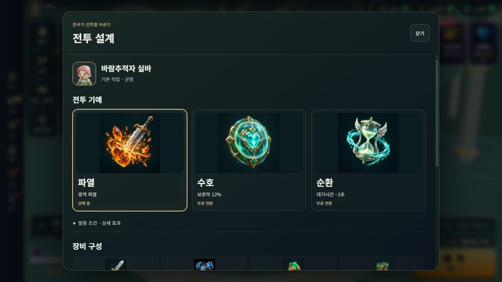
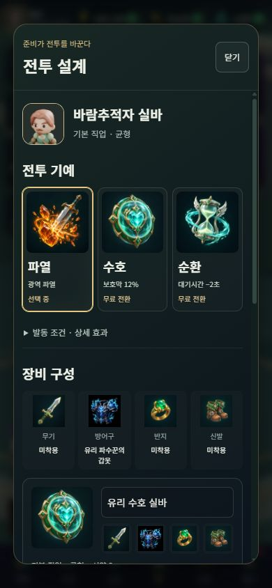
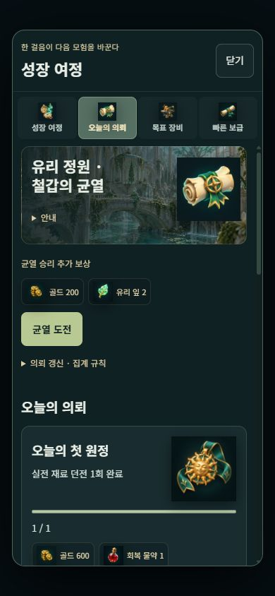

# 그림 중심 RPG 인터페이스

전투 설계에서 기예 설명과 장비 저장 안내가 한꺼번에 길게 노출되고, 기예를 문자 기호로 구분하던 문제를 개선한다. 그림 옆에 실제 한글 이름과 핵심 효과를 배치하고, 발동 조건과 긴 안내는 키보드로도 열 수 있는 `details`에 담는다.

## 적용 범위

- 전투 설계: 파열·수호·순환 그림 카드, 장비 부위 그림, 저장 구성의 장비 미리보기와 비교·적용 동작.
- 성장·각인과 성장 여정: 전투 방식·서약·숙련·의뢰·보상의 그림과 핵심 정보.
- 도감·능력치: 원본 영웅/몬스터 초상화, 실제 경험치 진행, 발견·등급·검색 필터와 펼쳐 보는 설명.
- 원정 메뉴: 던전·결투장·공방·전직·퀘스트 메뉴 그림, 재료와 제작 비용, 물약과 전리품 보상. 공방의 단순 도형 장식은 새 공방 원화로 교체하고, 넓은 화면은 제작 카드를 두 열로 배치한다.
- 로비·장비·설정: 이미지 메뉴, 비어 있는 장비 부위, 키보드로 조작할 수 있는 음향·진동 스위치.

제작 비용, 부족한 재료, 전직 조건, 저장 실패 알림, 다른 영웅의 장비 이동 경고는 기본 화면에 유지한다. 피해·보상·경험치·획득 규칙과 기존 맵·캐릭터·개별 장비 원화는 변경하지 않는다. 이미지 안에 글자를 넣지 않으며, 접근 가능한 이름과 수치는 DOM 텍스트로 남긴다.

## 이미지 출처와 검수

ChatGPT GUI에서 인앱 브라우저 탭 하나를 재사용하고, 세트마다 새 대화에 독립 원본 10장씩 요청했다. 총 5세트의 기예·장비·재료·소모품·메뉴·보상 그림이다. 원본 파일은 인증된 페이지의 자산 보존 기능으로 저장하고 파일 수, 픽셀 크기, SHA-256, 실제 피사체를 확인한다. 검수용 모음 이미지는 독립 원본 수에 포함하지 않는다.

채택한 독립 원본 50장은 각각 1254×1254이고, WebP는 각 384×384, 합계 856,482바이트다. 원본 및 배포 파일의 해시와 바이트 수는 `public/img/ui-crafted/manifest.json`에 기록한다. 원본·프롬프트·대화 영수증·검수 모음은 작업 산출물 `outputs/illustrated-ui/`에 보존하며, 계정 정보와 서명된 다운로드 URL은 저장소에 넣지 않는다. 화면에서 확인한 플랜은 Pro, 모드는 High와 매우 높음이며, 이미지 생성 모델 이름과 잔여 한도는 확인되지 않았다.

세 번째 기본 배치의 물약 변형 9장과 다섯 번째 기본 배치의 콜라주 5장은 부적합했다. 각 해당 대화에서 보정 배치를 한 번씩 요청해 단일 원본을 확보했다. 마지막 요청 전 일시 제한이 발생해 약 5분 대기 후 동일 대화에서 재개했다. 후보 파일 총 64개 중 독립 원본 50개를 채택했으며, 부적합 후보 14개는 별도로 보존한다. 콜라주를 잘라 독립 원본 수에 포함하지 않았다.

## 검증

- Bun 1.4.2 `bun run check`: 타입 검사, 367개 테스트 / 9,612개 assertion, 배포 빌드 통과. 50개 파일의 해시·중복·용량과 모든 자원 매핑을 검사한다.
- IAB 실제 게임: 1280×720, 390×844, 844×390에서 주요 창의 이미지 로딩과 화면 경계 확인. 검사한 창에 가로 넘침과 깨진 이미지가 없으며, 긴 내용은 창 내부 한 곳에서 스크롤한다.
- 실제 저장 데이터로 기예 설명 펼치기, 저장 장비 구성 비교·적용 및 기존 기예 복원, 발견한 해골 몬스터 6종 검색, 물약 3종의 그림·제작 비용, 설정 스위치 클릭/Space 조작과 음량 72/38/84 유지 확인.
- RPG 컴포넌트 브라우저 fixture: 세 화면 크기에서 각각 21개 항목 통과. 이 fixture와 별도로 위 실제 게임 확인을 수행했다.
- 로컬 배포용 빌드의 오류 관찰: 런타임 예외와 오류 로그 0개. 모바일 크기 검증이며 실물 휴대전화의 발열·배터리 측정은 아니다.

이 변경의 요청 범위는 PR 검토이며 운영 배포는 포함하지 않는다.

## 검토 화면

| 모바일 전투 설계 | 모바일 성장 여정 |
| --- | --- |
|  |  |

[성장·각인 화면](ui-review/masterworks-mobile.png) · [공방 화면](ui-review/forge-desktop.png)
