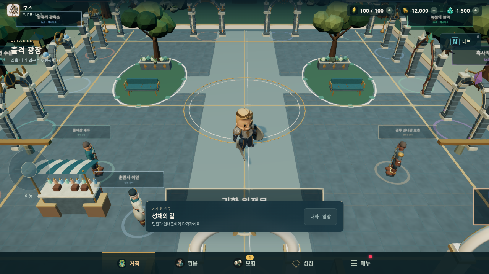

# Blade Surge 제작 후보 · 2026-10-07

반복된 교정 중 ‘검사는 통과해도 화면 변화가 느껴지지 않는다’, 영웅을 가리는 소품·안내창, 숲과 마을의 빈 공간을 우선 처리했다. 기존 `f8d6afb`의 합쳐진 기능과 캐릭터 외형 교정을 기준으로 작업했다. 10월9일 출시 목표를 위한 첫 통합 후보다.

| 부서 / 에이전트 | 이번 실제 결과 |
|---|---|
| 에셋 / `asset_library` | Blender 4.3.2 자체 제작 수목2종·바위·오두막·관문·등불 GLB6종, 재생성 소스·출처·해시 |
| 마을 / `world_village` | 광장의 정원·돌길·나무, 숲 청크·가옥·등불 배치, 기존 시설·동선 유지, 영웅 앞 수관만 좁게 절단 |
| 전투 / `combat_animation` | 공격 접촉에 맞춘 한 메시 검격 리본, 자체 합성 MP312종·40스킬 매핑, 다섯 영웅 리깅·클립 계약 검수 |
| 실플레이 / `playtest_qa` | 실제 입력으로 시설→원정→전투→정산→로비→재접속 확인, 가림 결함을 재현해 담당에게 전달 |
| 기획 / `requirements_design` | 실제 GLB134개·클립 미리보기·PNG 저장, 음원 재생, 6부서 갱신 보드·6장면 스토리보드 Studio |
| 통합 / `root` + `integration_review` | 동일 후보의 타입·전체 검사·빌드·지표·소스와 실제 화면 독립 검토 |

원본 얼굴·복장·리그·클립·기합/보이스를 보존했다. 신규 효과와 소리는 기존 접촉·피해 규칙과 게임 난수 알고리즘을 유지한다. Three.js 객체 UUID가 공유 `Math.random`을 소비하므로 객체 수가 달라진 전후 빌드의 난수 소비열·전투 결과까지 동일하다는 뜻은 아니다. 환경은 기존 Three.js r170 WebGL2에서 인스턴싱하고 낮은 품질의 배치량을 줄인다. Studio는 파일 변경을 5초마다 읽는 로컬 제작 도구다.

같은 시작 위치에서 실제 촬영한 [변경 전1280×720](media/studio-20261007/hub-before.png), [변경 후1280×720](media/studio-20261007/hub-after.png), [변경 후640×360](media/studio-20261007/hub-after-640.png), [제작 Studio](media/studio-20261007/studio-library.png)를 저장소에 보관했다. 생성 콘셉트 이미지가 아니라 실행 화면이다.

[실제 공격 리본](media/studio-20261007/combat-trail.png)과 [나무 북쪽의640 시야](media/studio-20261007/tree-sightline-640.png)도 같은 최종 후보에서 촬영했다.



## 실행과 제작

저장소 루트에서 기존 lockfile로 설치하고 `bun run dev`로 게임, `bun run studio`로 제작 Studio를 연다. Studio 주소는 `http://127.0.0.1:4310`이다. 실행 중인 에이전트의 영구 운영을 제공하는 도구는 아니며, 보드의 소유 파일·근거·다음 검사를 다음 작업에 재사용한다.

```sh
bun install --frozen-lockfile
bun run check
bun run studio
# 에셋 재생성
blender --background --python-exit-code 1 --python tools/art/build-environment-kit.py
python3 tools/audio/build-combat-library.py
```

[Studio 사용/구조](BLADESURGE_STUDIO.md), [전투·리깅 검수](combat-studio-v1.md), [환경 팩](../public/models/environment/studio-kit/README.md), [모바일 에뮬 검증](MOBILE_EMULATION_QA.md), [Android OS 에뮬 환경](ANDROID_EMULATOR.md)에 구현과 재개 방법이 있다. Blender 편집 원본은 `/workspace/scratch/bladesurge-environment-kit/studio-environment-v1.blend`에, 재생성 소스는 저장소에 보관한다.

## 이번 검증

- 최종 게임 코드: `bun run check` 타입·1,707 통과·기존4 제외·0실패·빌드 통과. 로그 `/workspace/scratch/bladesurge-check-final.log`.
- 측정 빌드: `2026-10-07T12:14:38.060Z`, `pwaRelease=be34c97e66c09a2cd29c`, 기준 SHA 위 작업 diff를 포함한 로컬 빌드(`dirty=true`). 후보 커밋의 새 clean 빌드 식별자로 바꾸어 과거 실행을 주장하지 않는다.
- 같은 seed·선택 기록·시작 레벨로 각각 단독 측정한 한 쌍이 기존 PRD 절대 밴드와 기본 상대 한도를 통과했다. 기준 JS 평균0.98ms·draw397 → 후보0.90ms·draw401. 후보12/12 구역 승리,190.6초(시뮬레이션),196처치,42드랍,오류0. 근거 `/workspace/scratch/bladesurge-{baseline,head}/metrics-solo.json`, `/workspace/scratch/bladesurge-head/compare-solo.log`. GPU FPS나 통계적 성능 향상,5쌍 예외 승인은 의미하지 않는다.
- 12:05 이전 후보의 실제 입력13단계는 통과했고 오류·HTTP실패·요청실패는0이었다. 실제 원정 에너지100→96,공격 홀드·3스킬·pause 입력 정리·동행 창의 manual pause 보존·포기 정산·로비/reload의 재화/영웅/인벤토리 보존을 확인했다. `/workspace/scratch/bladesurge-qa/final-native-1207/report.json`.
- 그 플레이에서 나무 북쪽의 영웅 수관 가림과640×360 안내창 가림을 발견했다. 수관4plane 처리와 짧은 가로 화면58px 안내창/44px 버튼으로 수정했다. 최종 고정 빌드에서 실제 emulated touch 이동1.4196m/해제,상점·나무 북쪽·수관 복원·관문·준비/입장7단계와1280/640 실제 PNG를 직접 확인했다. `/workspace/scratch/bladesurge-qa/targeted-final-1217/`의 전체 status는 마지막 공격20초 timeout 때문에 `fail`이며 위 단계의 개별 통과만 인용한다.
- 같은 최종 빌드의 고정880×400 화면에서 자연 clock 안정화 후 실제 짧은Space tap,down/up 홀드,shader draw6/alpha4·GL link,포기 receipt/로비 pending 정리4단계를 별도로 통과했다. `/workspace/scratch/bladesurge-qa/fixed-viewport-combat-1223/report.json`. game/HTTP 오류0,로비MP3 media 요청취소1은 별도 원본으로 남겼다. 첫 화면 변경 직후 timeout 원인을 이 재시도만으로 확정하거나 제품 코드가 수리됐다고 주장하지 않는다.
- Studio는 실제 구조·6kit/12audio 해시·GLB/클립·12MP3decode/play·보드 갱신·390px 세 탭·HTTP 경계를 확인했다. 반복 리그 교체의 live texture는7로 유지했다. `/workspace/scratch/bladesurge-studio-qa/final-report.json`.

원본의 Indexed/non-indexed 병합 실패, Studio 압축 리그 CSP 실패·모바일 넘침, 나무/안내창 가림 기록을 보존하고 수정 후 검사를 분리했다. 위 검사는 통합 후보에서 수행한 기록이다. 사용자가 에뮬 환경·머지·배포를 요청하여 후속 검증과 정식 배포를 진행한다. 최종 상태는 [PR #131](https://github.com/aljjang95/blade-surge/pull/131)과 공개 서비스의 `/version.json`, 배포 영수증으로 확인한다. 실제 휴대전화 GPU·발열, 스피커/이어폰 믹스와 사용자의 화면/타격 체감은 클라우드 에뮬 검증의 범위에 포함되지 않는다.
