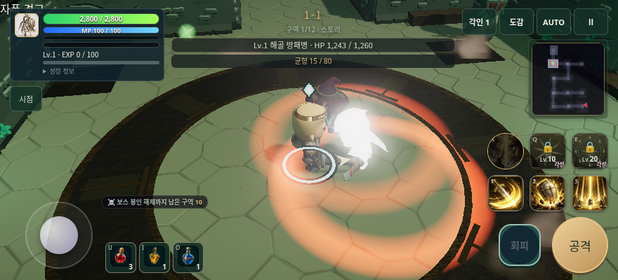
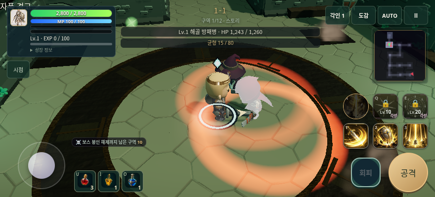
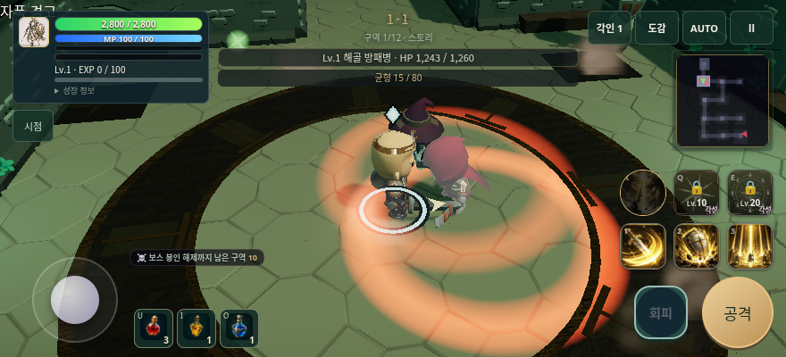
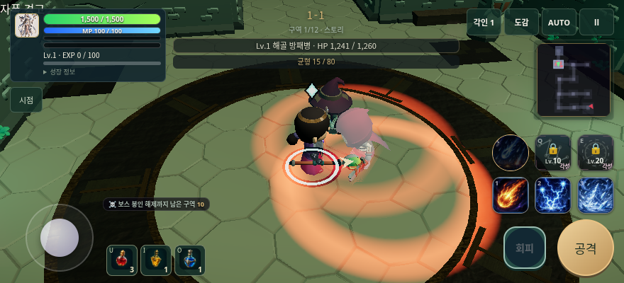

# 피격 발광 출시 후보 검증

기준 `da3e23a5d4d1a00990dd57d8c97b26225af4c64d`, 2026-10-01. 전투 계산과 보상·장비·텍스처는 유지하며, 모델 전체의 피격 발광을 제한하고 시간에 따라 빠르게 감쇠시킨다. 파티 복제도 같은 함수를 사용한다.

- `bun run check`: 타입검사·1223통과/1기존진단skip/0실패·production build 통과.
- 첫 층 AUTO: 같은 seed/선택/시작레벨 조건에서 기준·후보 모두 12/12 밴드. 후보181.2초 승리,193처치,46드랍,오류0. 평균2.8ms/p954.3ms,합산드로우콜414; 기존+15%/+20% 회귀 한도 통과. 한 쌍 표본이며 성능 향상을 주장하지 않는다.
- 실제 Worker 빌드: 부트→로비→출격→J키 공격→스텝 진행, WebGL2, 로컬 자산 응답과 페이지 예외 없음. 이 짧은 입력 검사 자체는 수동 한 층 완주 증거가 아니다.
- 제어된 비교: 기사/보통 품질 8장(평상시·일반 피격·치명타·감쇠 × 일반/동작 감소), 법사/낮은 품질 8장. 페이지 예외0. 원본 모델과 동일 카메라의 표시 검사이며 실제 승리 증거와 구분한다.
- 전투 혼전·보스, 제어된 원본/수정 이미지와 법사 동작 감소 화면을 직접 열어 확인했다. 의상 참여·원본 재질 보존·장비/유령 발광 복원·dt 분할·액터 재생성·파티 체력 복제 회귀를 포함한다.

| 일반 피격의 제어된 적 영역 | 기준 | 후보 |
| --- | ---: | ---: |
| 창백한 픽셀(minRGB≥190,채널차≤15) | 3749 | 270 |
| 평상시 이미지와 RMS 색 차이(0–255) | 145.33 | 95.12 |
| 감쇠 중 RMS 색 차이 | 110.79 | 49.30 |

영역은 화면 x475,y150,65×100이다. 픽셀 값은 해당 장면의 시각 진단이며 재미·기기 성능·AAA 품질 점수가 아니다. 매우 밝은 픽셀(RGB≥245) 카운트는 양쪽 모두0이어서 유효한 개선 근거로 쓰지 않았다. 중간 장면에는 HUD/스킬 효과가 남고 두 빌드의 평상시 화면에 작은 차이도 있으므로 이 수치를 모든 적·장면의 비율로 확대하지 않는다.

원본 지표·재질 기록·시각 진단·source SHA256·입력 검사는 [report.json](report.json)에 보존했다. 후보 검사 당시 빌드는 미커밋 상태임을 원본 `_build.dirty`에 남겼다. 최종 배포는 clean 커밋에서 재빌드하고 live SHA를 대조해야 한다.

스킬 효과 중첩에 의한 영웅 가림, 실제 휴대전화 멀티터치/GPU/오디오, 자연 성장·장기 반복 플레이는 미검증/후속이다. 코드 diff 검토는 primary가 수행했고 독립 에이전트 검토를 완료했다고 표시하지 않는다. 새 3D/이미지/음악 자산 생성·유료 호출은 없다.

GitHub API와 live origin은 클라우드 egress 차단, `apex-vault`는 미설치다. PR 머지·보호된 배포·운영 검증은 아직 완료하지 않았다.
