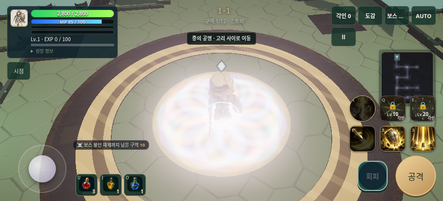
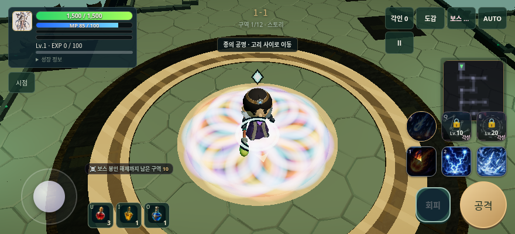
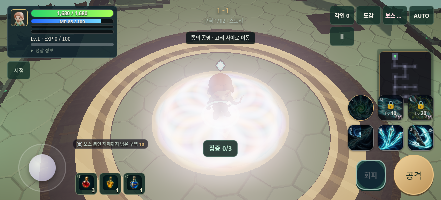

# 충격파 링 배치 후보 검증

기준 `4c977602e1189526c23524ae1d37765ea88f7881`. 기존 링의 재질·텍스처를 하나의 InstancedMesh로 묶는다. 위치·색·확대·페이드·수직 방향과 전투 판정은 유지한다. 최대 256개의 장식 링을 재사용하며, 포화되면 가장 오래된 장식만 교체한다.

- `bun run check`: 타입검사, 1248통과/2기존skip/0실패, production build. 네 개의 링 검사에는 화면을 그리지 않는 스텝과 렌더 콜백·자원 소유권 회귀가 포함된다.
- 실제 키보드 첫 스킬 입력: 기사/보통, 법사/낮음, 궁수/보통·동작 감소. 상태 전환·MP·쿨다운을 확인했다.
- 같은 고정 장면의 링 32개: 기존은 장면 draw +64(양면 분리), 후보는 +1. 소멸 뒤 원래 호출 수로 복귀, 전투 중단 뒤 비움, 새 전투에서 재발사. 페이지/콘솔 오류0. 실제 전투와 같은 선형 합성 타깃의 단일 장면 측정이다. 링 프로그램은 출격 준비 이후 다시 컴파일되지 않는다.
- 경고 형상·위치·색·남은 시간은 양쪽에서 유지된다. 제어 장면의 중앙 390×195 영역은 채널 최대 차이1/255, 평균 차이 약0.002/255. 모든 이미지를 직접 열어 확인했다.
- 첫 층 AUTO 예비 표본: 167.4초 승리, 198처치, 34드랍, 무보상8.8초, 피격0.157, 평균2.27ms/p952.4ms, draw389, 오류0. 기존 절대 밴드12/12. 처음 기준선은 draw425로 실패했고 원본을 보존했다. 그 기준선의 평균1.89ms와 단순 비교하면 +15% 한도를 넘으므로 이 예비 표본을 출시 상대 게이트 통과로 쓰지 않는다. 출시 검증은 별도의 사전 선언 clean 커밋 5쌍에서 수행한다.

첫 clean 후보 `13164980acb8191c734eee42e2165debf012ae21`의 사전 지정 5쌍은 모든 절대 밴드를 통과했지만 두 쌍의 프레임 +15%에 실패했다. [원본 시리즈](attempt1-series.json)를 보존했다. 새 후보는 행렬·버퍼 갱신을 실제 그리기 직전으로 미루고 전송 범위 객체를 재사용한다. 새 시리즈 검증이 끝나기 전에는 승격하지 않는다.

[report.json](report.json)에 원본 빌드의 dirty 표식과 이미지 SHA256을 보존했다. 이 문서 작성 시 후보는 미커밋 빌드이며, clean 소스·성능 게이트·머지·배포 완료를 뜻하지 않는다. 최종 시리즈와 배포 확인은 PR의 출시 체크포인트에 기록한다.

앞선 영웅 주변 효과 감쇠·조명 제한 후보는 두 번의 고정 화면 비교에서 실패하여 제외했다. 그 코드와 실패 자료는 작업 폴더에 보존했다. 링 배치는 이 가독성 문제를 해결했다고 주장하지 않는다. 자연 수동 완주, 실기기 GPU/열/멀티터치/오디오, 장기 반복 플레이와 AAA 판정은 남아 있다. 새 자산과 유료 호출은 없다.
