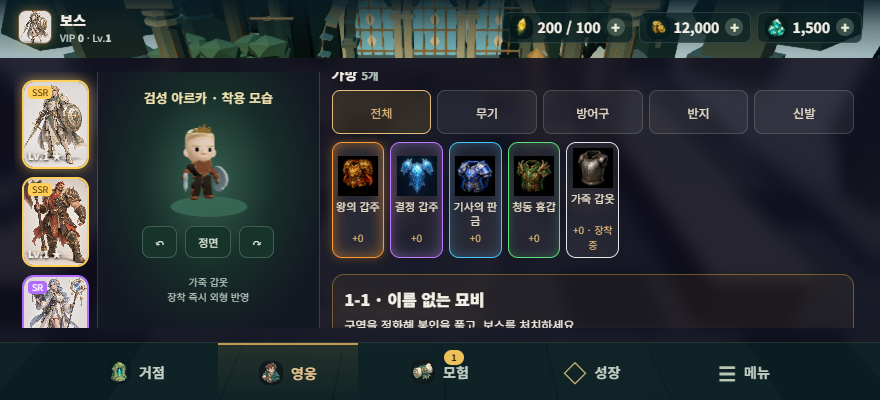
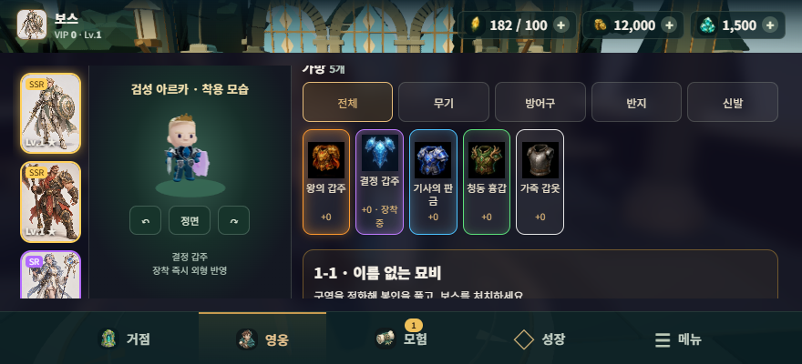
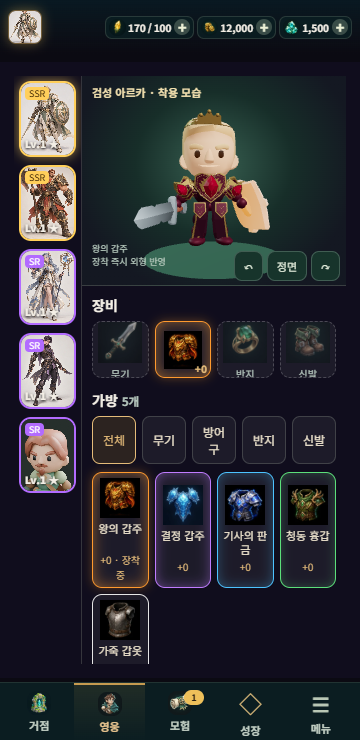
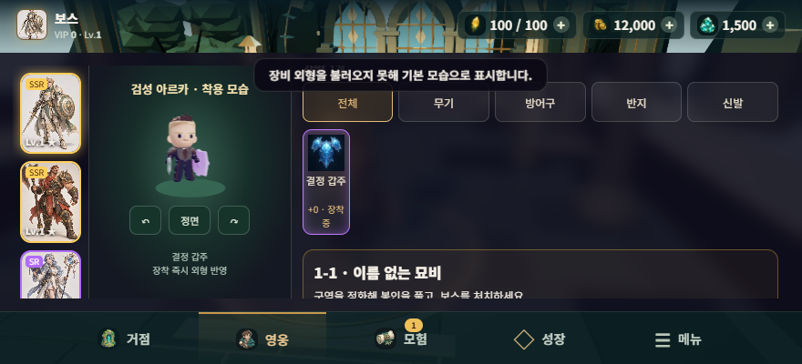
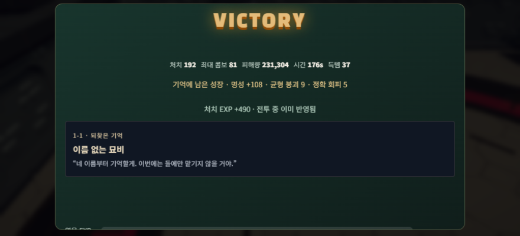

# Blade Surge · 배포 점검과 개선 계획

작성일: 2026-09-20. 대상: `aljjang95/blade-surge`, PR #65, `https://blade.tllhouse.com`.

## 현재 판정
새 버전의 운영 배포는 미실행이다. 운영 버전은 `d50345c967d8da178a434e30d793994d440079f0`, 이번에 화면까지 검사한 장비 코드 기준은 `a050187ae232e915992f781c271fb1c8cf764f8b`이다. 운영 서비스 도그푸딩과 새 후보의 로컬 검증을 구분한다. 가격·능력치·드랍 확률·결제·사용자 저장 형식은 변경하지 않았다.

이번에 이전의 전용 QA 작성 차단은 해소됐다. `tools/armor-release-qa.mjs`, `tools/armor-fallback-qa.mjs`를 실제 작성·실행했으며, 5종 장착·실제 UI·전투·오류 복구를 검사했다. 아래 완료 여부는 코드 존재가 아닌 관측 결과다.

## 실측 요약
| 표면 | 결과 | 범위 |
|---|---|---|
| 새 갑주 로컬 게임 | 33개 검사 통과 | 5종 UI 장착, 장비창/로비/전투 일치, 실제 터치 이동·공격·회피, 저장 재로드 |
| 실패 복구 | 통과 | 결정 갑주 다운로드를 503으로 실패시켜도 장착 기록·기본 외형·얼굴 보존, 오류 안내 표시 |
| 반복 교체 | 5회전 안정 | 회전마다 5종 교체 후 해제. geometry 67 / texture 85 / program 113 유지. VRAM 바이트 측정은 아님 |
| 실제 운영 서비스 | 16개 검사 통과 | 기존 live에서 12/12방 승리, 192처치, 37드랍, 다음 스테이지2·Lv5·가방43, 재접속 보상 유지 |
| 실행 장치 | RTX 3070 / D3D11 | Windows Chrome의 WebGL2. 물리 Android/iPhone 검사와 다름 |
| 부팅 관측 | 후보 로컬 2.032초, 운영 7.223초 | 각 1회·서로 다른 전송 표면. 속도 개선율로 비교하지 않음 |

전투 완주는 고정 시간 간격 AUTO 시뮬레이션이며 수동 실력·재미·휴대폰 FPS의 증거가 아니다. 후보 검사의 인벤토리와 에너지는 격리 브라우저의 테스트 데이터다. 운영 서비스에서는 새 브라우저 저장을 사용했고 결제와 금지 백엔드 쓰기는 0건이다. 후보에서 차단한 Google Fonts의 네트워크 오류 2개는 의도된 격리 결과이며, uncaught 예외·shader 오류는 0이다.

세로 화면은 최초 회전 안내를 거친 후 실제 `세로로 계속하기`를 눌러 검증했다. 360×740에서 가로 넘침이 없고 장비창의 모델이 보였다. 640×360에서는 착용 미리보기 Canvas 높이가 73px여서 세부 갑주를 판별하기 어렵다.

## 출시 환경 복구
기존 Library 백업에서 7,457바이트의 검증 기준 문서를 찾았다. 원래 고정 SHA-256 `86b358d66325020b20abd1bd9143f25da9a57da20918443f0439e1ed1ccfc69b`와 바이트 단위로 일치함을 확인하고 원래 경로에 복원했다. 새 정책을 작성하거나 allowlist를 변경하지 않았다. 복원 뒤 `runtime:portable:validate`는 종료 코드 0으로 통과했다.

WSL 서비스와 기존 Ubuntu-24.04 등록·38,664,142,848바이트 ext4.vhdx는 남아 있으나 설치된 wsl.exe가 빠져 있었다. Microsoft WSL 2.7.14 공식 MSI의 SHA-256과 서명을 확인하고, 시스템 설치 없이 사용자 작업 폴더에 클라이언트만 추출했다. 버전 조회는 성공했으나 Ubuntu 실행은 `Wsl/Service/CreateInstance/CreateVm/HCS/ERROR_FILE_NOT_FOUND`로 실패했다. 디스크 삭제·등록 해제·권한 확대는 하지 않았다.

독립 코드 검토는 native Codex에 `gpt-6-astra / high`, 읽기 전용으로 두 번 요청했으나 각각 180초·120초 제한에서 최종 판정 없이 종료했다. 중간 추론을 승인으로 사용하지 않았다. 승인된 OCI 실행 및 trusted review/merge launcher·서명 Proof가 없으므로 main 병합·운영 배포는 하지 않는다.

## 개선·업그레이드 우선순위
아래 수치 중 실측으로 표시하지 않은 항목은 다음 배치의 합격 목표다. 기능을 계획한 것이며 이번 배포에 반영했다고 주장하지 않는다.

| 순서 | 과제 / 근거 | 제작·수정 범위 | 합격 기준 | 원복 |
|---|---|---|---|---|
| P0-1 | 출시 실행환경 복구 / WSL VM 시작 실패, trusted launcher 없음 | 기존 디스크와 등록을 보존한 WSL 정식 복구, 현재 canonical installer로 검증 실행기 복원. OS 관리자 작업은 해당 권한 범위 확인 후 실행 | 기존 Ubuntu에서 pinned OCI image canary, exact-tree CI, fresh independent review, signed Proof 모두 통과 | 기존 VHDX·설정 보존, 새 설치 영수증 기준 제거. unregister·임의 키 생성 금지 |
| P0-2 | 첫 실제 배포 및 배포본 증거 보존 / 현재 서비스는 구버전 | 검증된 PR의 live base/head 재대조→기존 exact-head merge→lease를 쓰는 deploy.mjs→새 live QA | 새 commit/version/pwaRelease·Cloudflare version·자산 해시 일치, 배포 후 방 완주·저장·갑주 UI·오류 0. prior rollback version 확정 | 기존 deploy lease/receipt로 배포 전 Cloudflare version 복귀; 원격 결과 불명 시 재배포 금지 |
| P1-1 | 가로 장비창 가독성 / 640×360의 Canvas 높이 73px | 착용 미리보기를 확대 모달 또는 독립 구역으로 제공; 필터·장착 버튼은 유지 | 확대 보기에서 캐릭터 높이 180px 이상 목표, 360px 세로/640px 가로 넘침 0, 주요 터치 영역 44px 이상, 닫기·회전·초점 복구 | 장비창 UI 변경만 되돌리고 같은 장비 상태·저장 유지 |
| P1-2 | 일시적 다운로드 실패 후 즉시 재시도 / 503 폴백은 통과하지만 preload promise는 실패를 계속 보관 | 선택한 장비 우선 로딩, 명시 재시도, 동일 ID 요청 병합, 늦은 응답 폐기 | 503→정상 전환에서 재접속 없이 외형 복구, 장비/능력치/선택 유지, 이전 아이템 응답이 새 아이템을 덮지 않음, 동시 다운로드 2개 이내 | 기본 외형 폴백으로 복귀; 아이템 데이터 변경 없음 |
| P1-3 | 실제 동작 중 가림·관통 / 수치 포즈와 대표 입력은 검증, 전 동작 외관 미승인 | 5종×17클립×24위상, 정면/측면/후면 및 달리기→공격→회피 전환 영상; 위험 어깨·허리 부품만 조정 | 2,040 수치 포즈 통과 + 독립 시각 검토. 얼굴·손·무기 소켓 이탈과 큰 판금 관통 0. 미술 판정은 숫자만으로 자동 승인하지 않음 | 각 에셋의 이전 불변 revision 유지; 합격한 부품만 채택 |
| P1-4 | 득템 가치 전달 / 실제 착용은 구분되지만 UI에서는 크기가 작고 아이콘과 실물 차이 큼 | 득템 카드에 현재 장비 대비 정보·실제 착용 미리보기·장착 동선 연결 | 새 아이템 선택→비교→장착 2동작 이내 목표, 능력치와 외형 ID 동일, 취소 시 원래 장착 유지, 획득 확률/가격 변화 없음 | UI/이벤트 연결만 원복 |
| P2-1 | 전송·메모리 효율 / 갑주 5종 원시 GLB 합계 5,966,124바이트, 결정은 재질 8개 | 공통 의상·텍스처 공유, 재질별 묶음·선택적 프리로드, 필요할 때만 LOD | 같은 실제 화면에서 형상·UV·재질 보존; 원시/압축 전송량 별도 계측, 30회 교체·재입장 후 그래픽 자원 비증가, 축소 목표는 기준 측정 뒤 결정 | 기존 5개 GLB와 manifest로 되돌림 |
| P2-2 | 실기기 성능·재개 / 현재 GPU는 Windows RTX3070 | Android Chrome·iPhone Safari 각각 15분 장비 교체/전투/백그라운드/회전/오디오 점검 | 실제 프레임 p50/p95·메모리·장시간 변화 기록. 30fps 목표는 실측 후 판정; 복귀 후 입력·소리·장비 정상, 저장 손실 0 | 문제가 있는 품질 옵션을 이전 값으로 복귀 |
| P2-3 | 반복 제작을 실제 생산성으로 관리 / 기존 5종은 같은 기본형에서 재현 가능 | 새 갑주마다 레시피·입력 해시·형상/재질/동작 검사·재작업 사유 기록. 새 직업은 별도 리그 계약 | 합격 외형 1종당 디자인+기계 처리+수정+검수 시간을 모두 집계; 색상 변형을 새 설계로 과장하지 않음; 자산당 최대2후보/2회 수정 | 무효 후보 제외, 승인한 원본·레시피·검사 기록 보존 |

## 실행 순서
1. 출시 복구 배치: P0-1만 처리한다. 새 에셋 추가·다른 제품 변경·대량 스킬 설치는 하지 않는다.
2. 배포 배치: P0-2를 통과한 뒤 운영에서 동일 갑주 테스트와 실제 서비스 관측을 재실행한다. `배포 승인 있음`과 `검증 통과`를 구분한다.
3. 체감 개선 배치: P1-1과 P1-2를 작은 가역 변경으로 처리한다. 그다음 P1-3/4를 순서대로 검증한다.
4. 확장 배치: 실기기 결과를 기준으로 P2-1/2를 맞춘 뒤 새 장비군·직업으로 확대한다. 최상위 아이템의 외형부터 무한히 새로 만들지 않는다.

## 판정 방식과 남은 위험
현재 기능 테스트 결과는 검증됐지만, 독립 미술·최종 코드 검토와 signed release Proof는 없다. 그러므로 최종 출시 승인이나 도메인팩 승격 점수를 임의로 만들지 않았다. 기존 가중치(정확성 .25, 적합성 .20, 근거 .15, 실제 런타임 .15, 독립검토 .10, 수정효율 .05, 복원력 .05, 비용/지연 .05)를 사용하되 미측정 값은 unknown으로 남긴다.

이 계획은 새 Supervisor/하네스/상시 자동 작업을 만들지 않는다. 기존 APEX Universal Harness의 같은 프로젝트에서만 실행한다. 실제 결제·사업 방향·가격·권한·파괴적 삭제는 별도 보호 경계로 유지한다.

## 실제 캡처와 증거

`RESULT.json`에 원시 보고서 경로·SHA-256과 표면별 결과를 보존했다. 캡처는 재연출하거나 다른 모델로 합성하지 않은 실제 브라우저 화면이다. 운영 승리 캡처는 새 버전이 아니라 기존 d50345c 버전이다.
